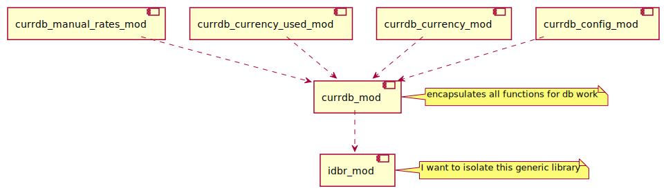

[comment]: # (lmake_md_to_doc_comments segment start A)

# pwa_currency_converter

[comment]: # (lmake_cargo_toml_to_md start)

**currency converter Progressive Web App**  
***[repo](https://github.com/LucianoBestia/pwa_currency_converter); version: 2021.519.1431  date: 2021-05-19 authors: Luciano Bestia***  

[comment]: # (lmake_cargo_toml_to_md end)

[comment]: # (lmake_lines_of_code start)
[](https://github.com/LucianoBestia/pwa_currency_converter/)
[](https://github.com/LucianoBestia/pwa_currency_converter/)
[](https://github.com/LucianoBestia/pwa_currency_converter/)
[](https://github.com/LucianoBestia/pwa_currency_converter/)
[](https://github.com/LucianoBestia/pwa_currency_converter/)

[comment]: # (lmake_lines_of_code end)

[](https://github.com/LucianoBestia/pwa_currency_converter/blob/master/LICENSE) [](https://github.com/LucianoBestia/pwa_currency_converter/)

## PWA

PWA stands for `Progressive Web Application`.  
It is a 2015 web browser standard that allows web pages to be used like native applications.  
The major benefits are:  
  
- the browser is sand-boxing the app for security (no access to the local file system or other sensitive data, impossible to add viruses, malware or ransomware)  
- web apps are cross-platform and cross-browser (write once, run everywhere on all modern browsers: desktop and mobile)
- standard web technologies: HTML, CSS, javascript and WASM. (I code in Rust and than compile to WASM)
- easy of install and update (it is just a web page with some added functionality for performance and usability)  
- good performance  

## Currency exchange rates

I will get the daily exchange rate in json format from:  
<http://www.floatrates.com/daily/eur.json>  
and fill it into the local browser indexeddb.  
It will be possible for the user to modify the exchange rate to calculate exactly what he needs.  
The exchange rates are downloaded every time the base currency is changed or a refresh is executed.  

## Development

In Visual Studio Code press `ctrl+j` to open the Terminal window.  
Use `cargo make` to see the prepared steps for deployment like:  
`$ cargo make release`  
And then follow the instructions on the screen like:  

- Run the web server in a separate terminal: `cd ~/rustprojects/pwa_currency_converter/web_server_folder/;basic-http-server`  
- Run the web app in your browser: <http://127.0.0.1:4000/pwa_currency_converter/>  

Oh, today I did everything right, but the browser said "This site can't be reached". After many attempts I discovered, that WSL2 `localhost` or `127.0.0.1` connection to Win10 is broken after putting the laptop to sleep. I have to restart the WSL in PowerShell Run as administrator with  
`Get-Service LxssManager | Restart-Service`.  
Not nice and very difficult to discover because WSL2 is running just fine, except this.  

In the browser (chrome, edge, firefox) use F12 developer tools to easily see the content of indexeddb in F12. Very convenient.  
Some tips for PWA: <https://firt.dev/pwa-design-tips/>  

## indexeddb

Indexeddb is the standard database storage inside the browser. It is not Sql. It is a document database.  
It is more or less a key-value storage, but the value can be a javascript object and that can be complex.  
The api is in javascript, uses old fashioned callbacks and events, completely async, without async/await or Promises.  
I experimented with indexeddb in my project <https://github.com/LucianoBestia/indexeddb_from_rust>.  
Now it is time to make it work. Still I don't know about the performance because Rust and Javascript don't really use the same objects.

## Typescript adventure

For my only module in javascript `idb_export`, I will rather use Typescript. I will write some typescript code, transpile it to javascript and invoke that from rust.  
In runtime my code will use only the javascript file. Typescript is used only in development.  
The Typescript compiler must be installed with `npm` that is a part of `nodejs`. I must first install `nodejs`.  
On Debian the package `sudo apt install nodejs` is old version 10. The recommended version is 14, but it is from another package source.  
nodesource.com is providing a script to add the new package source and install `nodejs`.  
This is the commands:  

```bash
cd ~
curl -sL https://deb.nodesource.com/setup_14.x -o nodesource_setup.sh
nano nodesource_setup.sh
sudo bash nodesource_setup.sh
sudo apt install nodejs
node -v
npm -v
sudo apt install build-essential
```

Now I can install Typescript:  

```bash
npm install -g typescript
tsc --version
tsc --help
```

In the terminal I just use `tsc` to transpile my source code with settings from `tsconfig.json`.  
I added this to my `cargo make` for easy developing.  
The typescript file is inside the `src` folder like rust source code files.  
The resulting javascript file is stored in the `js` folder of the web app folder.  

## typescript/javascript imports

I had major problems with `import` statements.  
I tried first with `npm install --save idb`. It saves the files in a separate `node_modules` folder. That didn't work nice with my `import` statements. I don't know why.  
At last I decided to create `idb` as a separate folder and copy the `node_modules/idb/build/esm`.  
I needed to play with `tsconfig.json` to make it work.  
I added the keys: baseUrl, rootDir, outDir, esModuleInterop and most important path.  
From one side this import paths are just like folder structure, from the other side they are like url paths.  
Confusing. But after a long experimentation I made it work. I hope I don't need ever to change this settings.  

## code flow

The browser opens `index.html`.  
There it runs `import init from "./pkg/pwa_currency_converter.js";`  
and `init("./pkg/pwa_currency_converter_bg.wasm");`  
This is the wasm code compiled from `lib.rs` and wasm-bindgen creates the magic to start the designated function.  
The `idb_exports.js` is the result of typescript transpilation of `idb_exports.ts`, my only typescript module.
Inside that module I need to import the `idb` module with:  
`import * as idb from '/pwa_currency_converter/idb/index.js';`
Then Rust code `idbr_imports_mod.rs` imports the `idb_exports.js` javascript module and functions.  
From here on we are now in pure (more or less) rust code.  

## missing unsafe

When importing javascript functions with `#[wasm_bindgen]` and `extern "C"`, the rust-analyzer shows a warning about `missing unsafe`. This is not correct, the rustc compiler compile it just fine. It is because the attribute macro wasm_bindgen uses magic and makes it safe. But rust-analyzer (for now) cannot understand attribute macros.  
For those looking to disable the missing-unsafe rule until it's fixed and are using VS Code, adding the following to your settings.json and reloading your editor will suppress these errors:

```config
"rust-analyzer.diagnostics.disabled": [
    "missing-unsafe"
]
```

## extern "C" - importing javascript functions

Javascript functions are imported using the `extern "C"` block.  
For now `rustfmt` has a bug that removes the word async, because here we have javascript functions and not C functions.  
The workaround is to add `rustfmt::skip`:  

```rust
#[rustfmt::skip]
#[wasm_bindgen(raw_module = "/pwa_currency_converter/js/idb_exports.js")]
extern "C" {
    fn check_browser_capability();
    #[wasm_bindgen(catch)]
    fn init_db() -> Result<(), JsValue>;
    #[wasm_bindgen(catch)]
    fn put_key_value(store: String, key: String, value: String) -> Result<(), JsValue>;
}
```

For a javascript function with no return value is simple:  
`pub(crate) fn check_browser_capability();`  
A javascript async function can return one JSValue.  
`pub(crate) async fn get_key_value(key: String, ) -> JsValue;`  
If we want to catch errors in the Promise, add attribute `wasm_bindgen(catch)`, then the functions returns `Result<JsValue, JsValue>`:  

```rust
#[wasm_bindgen(catch)]
pub(crate) async fn init_db() -> Result<JsValue, JsValue>;
```

The imported async fn needs to be await just like rust functions. The macro wasm_bindgen makes some magic to transform Promises to futures on import:  
`let currdb = open_db().await.unwrap();`  
Some of the functions are async and others are not. It can lead to strange problems if an async function is used as a normal function. This is a thing to be careful about. Rust will hopefully show a warning, but javascript will not.  

## pages

This PWA will have more pages. Pages are complete static html files inside tha /pages/ folder. They use the same css as index.html.  
It is easy to edit and preview pages because they are complete.  
The rust code will fetch the html, extract only the body content and set_inner_html to div_for_wasm_html_injecting.  
A page is a template, and some placeholders will be replaced with data.  
For `modal pages` I prepared a separate `div_for_modal`.  
I will not use a local router and will not change the URL address of this `single page web app`. I don't see a need for this.  

## serde-wasm-bindgen

The indexeddb is key-value. Key is a javascript string and value is any javascript object.  
That is really practical for javascript, but not so for rust.  
I will use [serde-wasm-bindgen](https://github.com/cloudflare/serde-wasm-bindgen) to work directly with javascript values from rust, because indexeddb stores javascript objects.  
From Rust to javascript:  
`serde_wasm_bindgen::to_value(&some_supported_rust_value)`  
From javascript to rust:  
`let value: SomeSupportedRustType = serde_wasm_bindgen::from_value(value)?;`  

## Currdb

IndexedDB can have more than one database at once. In this project I use only one: `Currdb`.  
My module `idbr_mod` contains all the necessary functions to operate with indexeddb. But it is all too generic. I don't want everywhere in my code to call a generic library. I want to isolate it.  
For that I created the module `currdb_mod` and encapsulated all the necessary functions for this database. I also re-exported some structs from the `idbr_mod`.  
My code must use only this module for any database need.  
For every `ObjectStore` I created its own module to make things more easy to separate and encapsulate.  
<details>
  <summary>plantuml diagram</summary>

```plantuml
@startuml
[currdb_manual_rates_mod] ..> [currdb_mod]
[currdb_currency_used_mod] ..> [currdb_mod]
[currdb_currency_mod] ..> [currdb_mod]
[currdb_config_mod] ..> [currdb_mod]
[currdb_mod] ..> [idbr_mod]

note right of (idbr_mod): I want to isolate this generic library
note right of (currdb_mod): encapsulates all functions for db work
@enduml
  ```
</details>  
  

A lot of functions are just public functions in a module. But for some I created objects with methods. It is a mix depending what is easier to write and maybe better for performance.  I didn't use the `Static methods` (methods without self as opposed to `instance methods`) here because the `module` is already a good container for functions encapsulation.  
